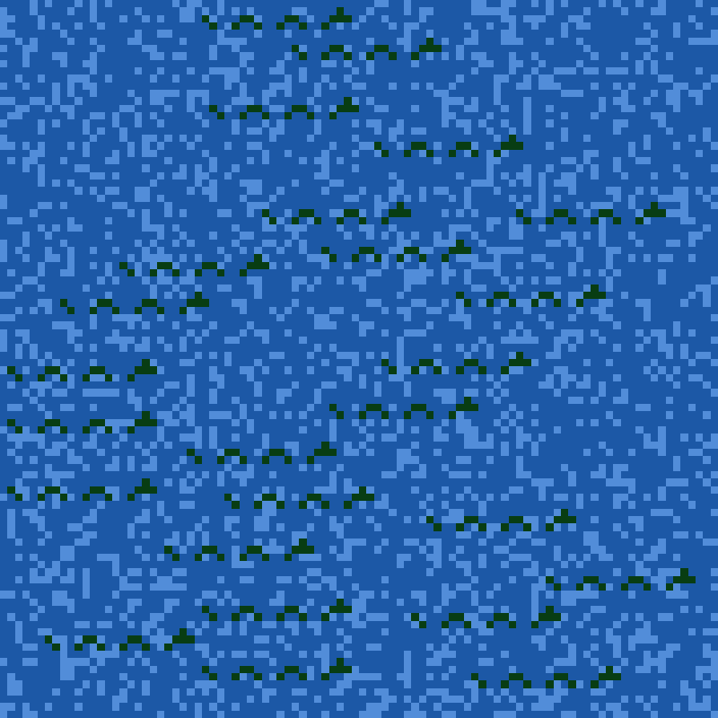

# Quickstart

To run, supply the year and day at the command prompt:

`clojure -X:run :year 2021 :day 2`

To test:

`clojure -X:test`

# Introduction

[Advent of Code](http://adventofcode.com) is a yearly event--25 magical
programming puzzles!

I've been doing Advent of Code somewhat halfheartedly for the past several
years. In 2021 I decided to be a bit more disciplined with my code (included a
"runner", a common library for "utilities", tests).

I also scooped up some of my code from previous years and jammed it into the
repository. Some of it works "as-is", some might need improvement. I have
aspirations to some day work my way through the "backlog" of previous years and
fill in the gaps.

# Selective overview: using the utility libraries

## util/matrix.clj

Many Advent of Code puzzles use tables, two-dimensional data, or some other
contrived data structure which can be thought of as a matrix. I've created some
utilities for working with matrices, especially reading, writing, and
visualizing.

```clojure
(def raw-matrix-string
  " 9 15  6
   13  4 18
    4 13  7")

(require '[net.bjoc.advent.util.matrix :as mtx])

(def my-matrix
  (mtx/from-string raw-matrix-string)) ;; cool, we can automagically "read" a matrix

(mtx/dump my-matrix)                   ;; dumping it to stdout is easy

(-> my-matrix
    (mtx/rotate 2)
    mtx/dump)                          ;; string together operations before dumping
```

## util/matrix_visualizations.clj

Beyond dumping a matrix to text, sometimes it's nice to look at a bitmap.

```clojure
(require '[net.bjoc.advent.util.matrix-visualization :as vis])

;; definitely want a good color scheme
(import '[java.awt Color])
(def ocean-pallette {\O (. Color getHSBColor (/ 133 360) 0.87 0.24)
                     \. (. Color getHSBColor (/ 214 360) 0.83 0.65)
                     \# (. Color getHSBColor (/ 214 360) 0.62 0.85)})

;; write an image file
(use '[net.bjoc.advent.year-2020.day-20])
(-> "data/year_2020/day_20.input"
    file->tiles
    assemble
    mark-monsters
    (vis/write-image-file "visualizations/2020_day_20.png"
                          :img-size [800 800] :pallette ocean-pallette))
```



